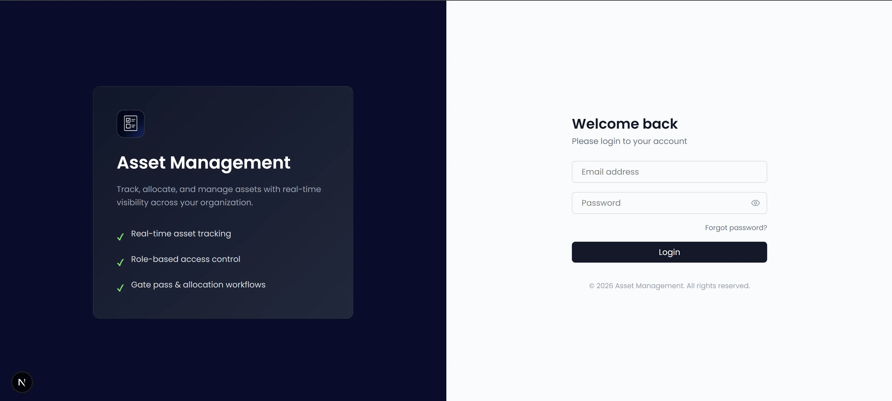
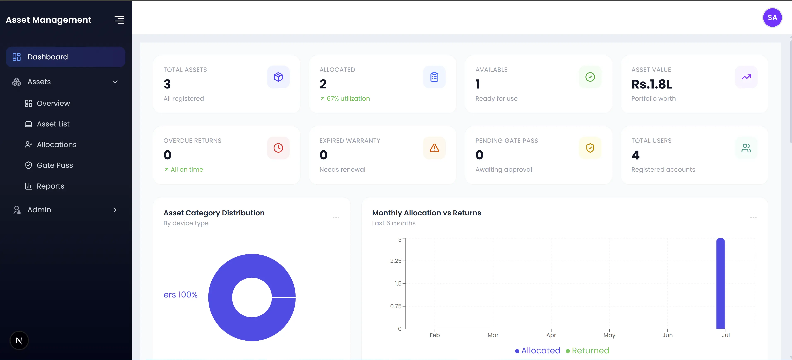
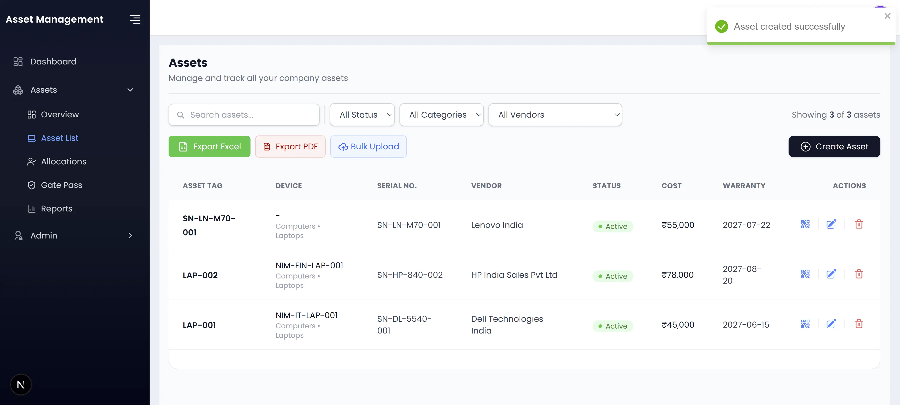
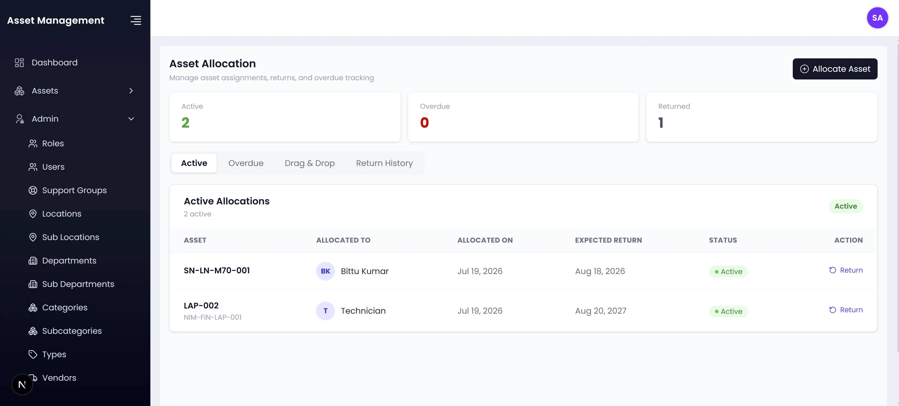
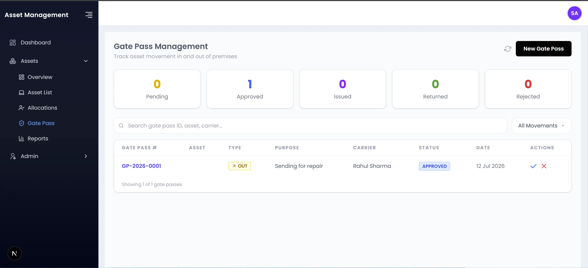
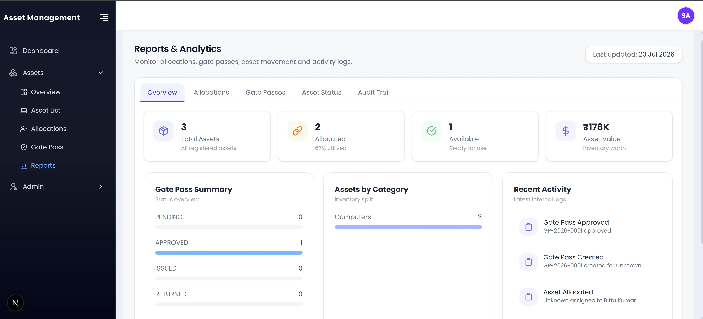
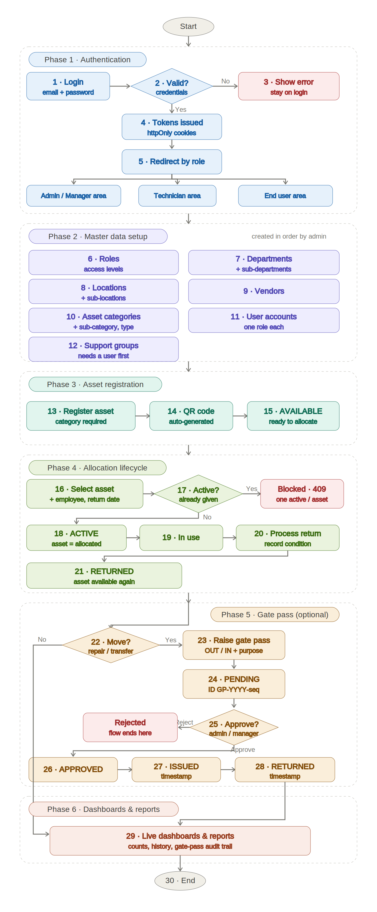
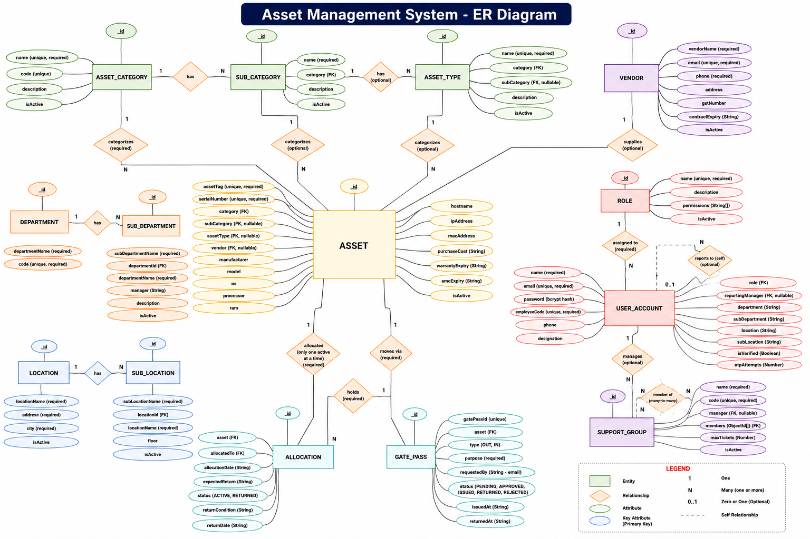
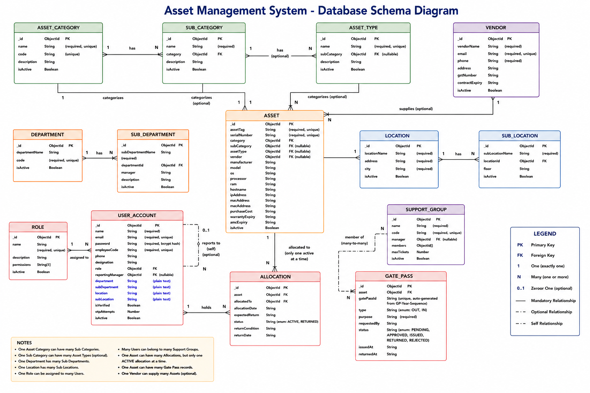

# Asset Management System

A full-stack IT Asset Management System built with Next.js, MongoDB, and Redux. It supports asset registration, employee allocation, gate-pass management, reporting, and role-based access for Admin, Manager, Technician, and End User.

This README documents the current implementation. Planned improvements are listed in the **Roadmap**.

**Live demo:** https://asset-management-1-619b.onrender.com/

## Table of Contents

- [Highlights](#highlights)
- [Screenshots](#screenshots)
- [Tech Stack](#tech-stack)
- [Feature List](#feature-list)
- [Application Flow](#application-flow)
- [How the Schemas Are Connected](#how-the-schemas-are-connected)
- [Entity Relationship Overview](#entity-relationship-overview)
- [Schema Diagram](#schema-diagram)
- [Project Structure](#project-structure)
- [Getting Started](#getting-started)
  
---

## Highlights

- **Authentication** — JWT, Refresh Tokens, httpOnly Cookies & OTP Password Reset
- **Role-Based Access** — Admin, Manager, Technician & End User
- **System Setup** — Auto-creates roles and admin account on first startup
- **Asset Allocation** — active allocation per asset
- **Asset Operations** — Bulk Excel Import/Export, QR Codes & Gate Pass Workflow (Pending → Approved → Issued → Returned)
- **Architecture** — REST API (17 Modules, 40+ Endpoints)
  
---

## Screenshots

### Login



### Dashboard



### Asset Registry



### Asset Allocation



### Gate Pass Workflow



### Reports &amp; Analytics



---

## Tech Stack

- **Frontend:** Next.js 16, React 19, Redux, Redux Thunk, Tailwind CSS
- **Backend:** Next.js Route Handlers, REST API
- **Database:** MongoDB, Mongoose
- **Authentication:** JWT, Refresh Tokens, httpOnly Cookies, bcrypt
- **Libraries:** react-qr-code, xlsx, react-pdf, pdfmake

---

## Feature List

### 0. First-Time Setup (Automatic)

- On first startup, the app auto-creates the 4 roles (Admin, Manager, Technician, User) and one Admin account.
- If an Admin account already exists, the seed process is skipped.
- The Admin email and password are configurable via environment variables.

### 1. Login and Security

- Email and password authentication.
- Passwords hashed using bcrypt.
- JWT authentication with access and refresh tokens stored in httpOnly cookies.
- Password reset using an email-based OTP.
- Logout clears the authentication cookies.

### 2. Role

- Create and manage roles.
- Assign permissions to roles.
- Assign roles to users.
- Role- and permission-based access control.

### 3. User Account

- Create and manage user accounts for system access.
- Stores name, email, password, employee code, phone number, and job title.
- Assign a Role and an optional Reporting Manager.
- Stores the user's Department, Sub-Department, Location, and Sub-Location .

### 4. Department

- A team in the company, like IT or Finance, with a name and short code.
- Independent — can be created first among the master data.

### 5. Sub-Department

- A smaller team inside a Department (e.g., "Network Support" inside "IT").
- Every Sub-Department belongs to one Department.

### 6. Location

- A physical place (office or branch) with a name, address, and city.

### 7. Sub-Location

- A smaller part inside a Location (e.g., one floor or room).
- Every Sub-Location belongs to one Location.

### 8. Vendor Management

- A vendor is the company that supplied an asset (e.g., the laptop supplier).
- Stores vendor contact details, GST number, and contract expiry date.

### 9. Asset Category

- Groups similar assets at the top level (e.g., Computers, Furniture, Printers).

### 10. Sub-Category

- Groups assets within a Category (e.g., "Laptops" under "Computers").

### 11. Asset Type

- Defines a specific asset (e.g., "Dell Laptop"). Optionally linked to a Sub-Category.

### 12. Support Group

- A small team of users (e.g., an "IT Helpdesk" group).
- Has one manager, a list of members, and a maximum ticket limit (default 10).

### 13. Asset Registry (Adding and Managing Assets)

- Manage assets like laptops, desktops, tablets, and other devices.
- Each asset has a unique Asset Tag and Serial Number.
- Stores technical (OS, processor, RAM), network (IP address, hostname), and purchase (cost, warranty, AMC) details.
- A unique QR code is generated for each asset — printable, downloadable, and scannable.
- Add, import, and export assets via Excel.
  
### 14. Asset Allocation (Giving Assets to Employees)

- Allocate an asset to a user with an expected return date.
- Each allocation links one asset to one user.
- The same asset cannot be allocated to two users at once.
- An Admin, Manager, or Technician can process a return and record the asset's condition.
- View full allocation history and track overdue allocations.
- Only an Admin can permanently delete an allocation.

### 15. Gate Pass Management (Moving Assets In and Out)

- Raise a gate pass request for a specific asset (with a unique Gate Pass ID).
- Status flow: Pending → Approved → Issued → Returned (or Rejected).
- Only an Admin or Manager can approve, reject, issue, or mark as returned.
- A Technician can only raise a request; an End User cannot raise one.
- Only an Admin can permanently delete a gate pass.

### 16. End User Self-Service View

- Shows only the logged-in user's own asset information.
- Displays assigned assets, returned assets, gate passes, and alerts.
- Read-only for End Users.

### 17. Reports and Dashboard

- **Dashboard:** total assets, allocated, available, total value, and overdue allocations.
- **Reports:** allocation history, asset returns, and gate pass records — filterable and exportable.
- **Audit trail:** records key actions (e.g., who allocated which asset, and when) — currently for allocation and gate-pass actions only.

---

## Application Flow



---

## Schema Relationships

- **AssetCategory → SubCategory:** One category can have multiple sub-categories.
- **AssetCategory → AssetType:** One category can have multiple asset types.
- **SubCategory → AssetType:** One sub-category can have multiple asset types (optional).
- **AssetCategory / SubCategory / AssetType → Asset:** Each asset belongs to one category and can optionally reference a sub-category and asset type.
- **Vendor → Asset:** One vendor can supply multiple assets.
- **Department → SubDepartment:** One department can have multiple sub-departments.
- **Location → SubLocation:** One location can have multiple sub-locations.
- **Role → UserAccount:** One role can be assigned to multiple users.
- **UserAccount → UserAccount:** Users can reference another user as their reporting manager.
- **UserAccount ↔ SupportGroup:** A user can manage one support group and belong to multiple support groups.
- **Asset → Allocation:** One asset can have multiple allocations, but only one active allocation at a time.
- **UserAccount → Allocation:** One user can have multiple asset allocations.
- **Asset → GatePass:** One asset can have multiple gate-pass records.

---

## Entity Relationship Overview



---

## Schema Diagram



---

## Project Structure

```
src/
  app/
    (auth)/            Login, forgot-password, verify-otp, reset-password pages
    (main)/            Authenticated app: admin, assets, end-user, technician, profile
    api/               Next.js route handlers (thin layer calling backend controllers)
  backend/
    modules/           One folder per domain: schema.ts + controller.ts + service.ts
    middleware/        auth.ts, role.ts, validate.ts, error.ts
    config/            db.ts, env.ts, jwt.ts
    constants/         roles.ts, messages.ts
    models/            counter.ts (used to generate sequential gate pass IDs)
  store/               Redux slices: one folder per domain (actions, reducer, types)
```

---

## Getting Started

```bash
npm install
npm run dev
```

Open http://localhost:3000 in your browser.

Create a `.env` file with the required environment variables, including:

- `MONGODB_URI`
- `JWT_SECRET`
- `JWT_REFRESH_SECRET`

Configure your mail settings if you want OTP and password reset emails to work.

On first startup, the application automatically creates the default system roles (`ADMIN`, `MANAGER`, `TECHNICIAN`, `USER`) and an Admin account. This process is idempotent and runs only if an Admin account does not already exist.

The default Admin account can be customized using the following environment variables:

- `ADMIN_NAME`
- `ADMIN_EMAIL`
- `ADMIN_PASSWORD`
- `ADMIN_EMPLOYEE_CODE`

Default credentials:

```text
Email: admin@assetmanagement.com
Password: Admin@123
```
---

